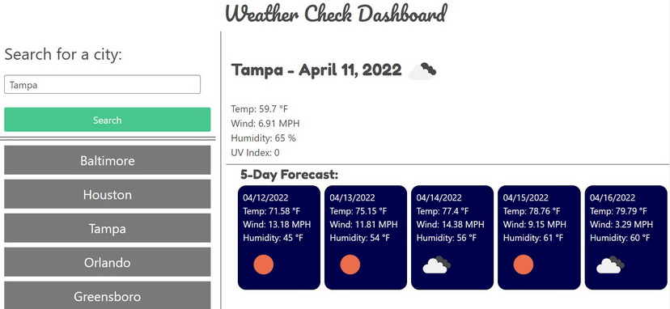

# Weather Check Dashboard
Application that pulls weather information from OpenWeather based on user input

## Objective
- To provide a weather application that can search for weather based on user inputting a city.
- The weather application will display the city name with the current date as well as the current temperature, wind speed, humidity and UV index.
- It will also display an icon to depict the current weather conditions.
- The UV index will change colors based on what the current value of the index.
- The application will also display a 5 day forecast with an icon as well.
- The application will save each entered city to the Local storage so that users leaving and comming back to the site will see what cities they have searched for.
- The list of saved cities will be clikable to re-display the weather for that city (Not implemented)

Repo link:
https://github.com/Crimsondrac1/WeatherCheckDashboard

Demo link:
https://crimsondrac1.github.io/WeatherCheckDashboard/

